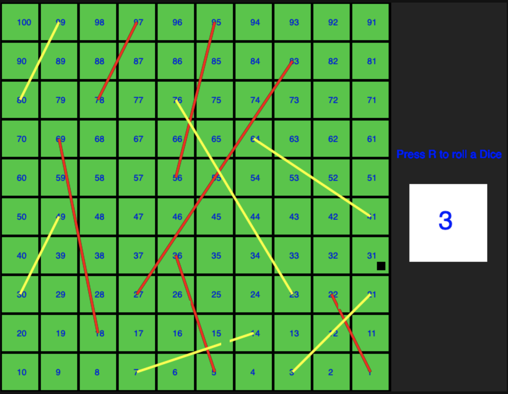

# Snakes and Ladders

The Snakes and Ladders implemented with functional style in JavaScript without libraries. Interface for Browsers

`functional_base` :- It deals with all the functional programming constructs. All the functions defined in this files are pure, immutable functions which always returns new state, it doesn't update the old states.

`web.js` :- This is responsible for Snakes and Ladders rendering, logic related to moving player up and down is handled here.

So we have divided entire board into Grids and each grid have (x,y) position now if player's position matches with ladder start position we move the player up or if it matches with the snakes end position we move it down.


# Usage

```bash
git clone git@github.com:murtaza-bagwala/functional-snake-ladder.git
cd functional-snake-ladder
And run html file
```

- Press R key to roll a dice

***Note*** :- Red lines are Snakes and Yellow lines are Ladders.


